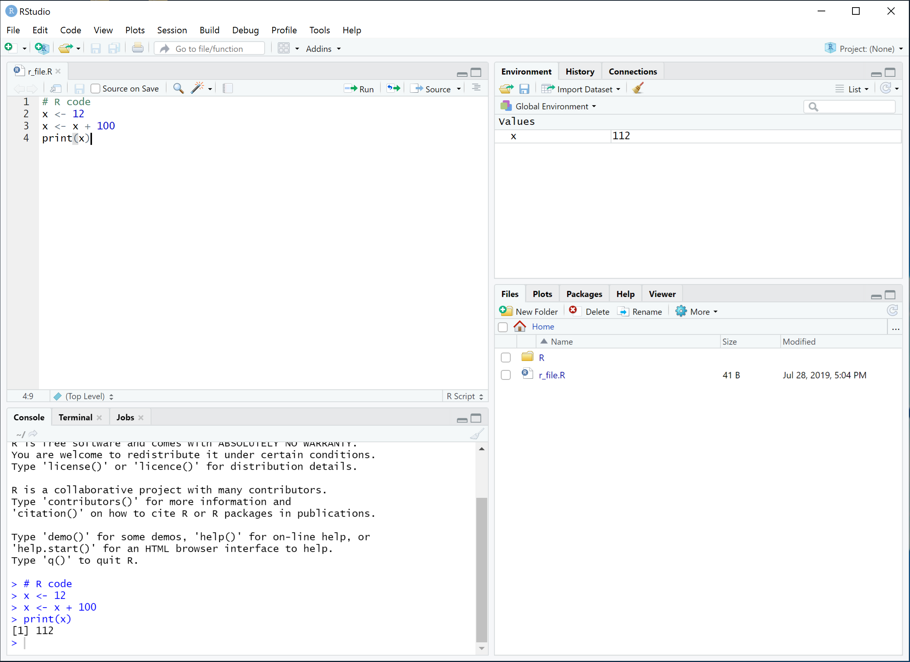

```{r setup, include = FALSE}
source('_format.R')
```

R is an interpreted language for analyzing and visualizing data.  It's very different from products like Minitab and JMP even though the users' goals are often the same.  Perhaps the most important factor for the success of R is that it's free and open source.  Because of its accessibility, many people have chosen to adopt it for research, for business purposes, and for teaching.  Some of them created packages that would let R do the analysis they needed to do, or as a way to enable people to do a new kind of analysis altogether.  R grew and grew.  Today it is an indispensable tool for many statisticians and data scientists.

There's no way to cover most or even much of R and the important packages.  Instead, I've tried to provide just a taste of R, enough to get people through the examples contained in the subsequent sections.  Each chapter following corresponds to the same numbered chapter in _Design and Analysis of Experiments_.  This document is very much a companion - on its own it will likely make little to no sense, but used with the textbook it should allow R users to follow along with the examples.

This chapter is divided into two main parts.  First, I will describe how to get and install R and associated tools. Second, I will cover how key features of the R language work.

# Getting Started

To get started we will first download the R interpreter so that we can run R code.  Then we will download the RStudio editor to make editing nice and easy.  Finally we will install the `MontgomeryDAE` package from GitHub to bring in all of the data-sets from the textbook.

## Installing the R Interpreter

At present you can find R through the website [https://www.r-project.org](https://www.r-project.org).  There you can download a version of R best suited for your operating system, and learn what code names each release has (the present release 3.6.1  is _Action of the Toes_).  

For macOS users, instead of installing R from the `pkg`, I'd recommend installing [homebrew](https://brew.sh) and installing R using homebrew.  At present you can do this by running the following from terminal:
```{bash eval=FALSE}
/usr/bin/ruby -e "$(curl -fsSL https://raw.githubusercontent.com/Homebrew/install/master/install)"
```
\noindent Next, to install R using homebrew simply run the following in the terminal:
```{bash eval=FALSE}
brew install r
```
\noindent The homebrew installation method makes things such as installing R source packages easier down the road.  Windows users can install [`Rtools`](https://cran.r-project.org/bin/windows/Rtools/index.html) to provide a toolchain for compiling source packages as well. 

When reading about R you'll see CRAN a lot.  CRAN standards for Comprehensive R Archive Network and it's where you'll actually be downloading R and most packages.  Packages are collections of code (in R, C, Fortran, or other languages), data sets, and documentation that we load using the `library` function.  There is a _huge_ variety of R packages that cover almost anything you could want (note the "almost" qualifier).

Microsoft began seriously investing in R back in 2015 when it acquired Revolution Analytics. Since then they've developed Microsoft R Open (MRO) which is their own runtime for R that has improved performance (see [https://mran.microsoft.com/open](https://mran.microsoft.com/open)) but often lags behind the current version of CRAN R.  Microsoft has integrated R into other products as well - you can run R code directly inside SQL Server queries. I tend to use CRAN R over MRO since that's the version packages are tested against.


## Install RStudio


Most people use an integrated development environment (IDE) called RStudio ([https://www.rstudio.com/](https://www.rstudio.com/)) when they work with R. In fact, once you start using RStudio if you ever have to go back to the regular R environment it feels very punishing.  A free version of RStudio is available for most operating systems.  The RStudio IDE is also extremely useful for publishing via RMarkdown, package development, and a host of other R-related activities.  

## R Studio Window

The RStudio window has four main panes.  The top left is where you can edit files and highlight code to run.  The bottom left is the interactive R session and you can enter commands there directly if you wish.  The bottom left also has a terminal tab so that you can use the command prompt or shell from within the application.  

```{r fig.align='center', out.width = "90%", fig.pos="h", echo=FALSE, out.extra='keepaspectratio'}
options(tinytex.verbose = TRUE)

```

\noindent The top right includes a list of all variables in the global environment and also has a history tab of all commands you've run.  The bottom right will show files, packages, plots, and help files while you work. RStudio has many more features which I will not cover. 

## Packages and Libraries

As I mentioned earlier, packages are collections of code, data, and help files that extend the capabilities of R. Some packages, such as `MASS`, are shipped with R.  Others can be downloaded and installed by R using the `install.packages` function (or in R Studio go to Tools > Install Packages).  Let's load the `MASS` package and use `fractions` to convert decimals to their nearest rational expression.

```{r}
library("MASS")
fractions(0.333333)
```

Above and throughout this document the output of commands will be displayed following the command as a comment.  Comments in R are everything after `#` to the end of the line. Above, the output of the `fractions` command is `1/3`, and so it is displayed as `# [1] 1/3`.  

The `MontgomeryDAE` package contains data files from the textbook as well as a copy of this document.  To get this package we need to use `devtools` to install it from GitHub. Installing `devtools` and loading it is simple:
```{r warning=FALSE, eval=FALSE}
install.packages('devtools')
library('devtools')
```
\noindent Then, to install the package from GitHub we use the `install_github` function.
```{r warning=FALSE, eval=FALSE}
install_github("ehassler/MontgomeryDAE")
```

\noindent You can then use the `browseVignettes` function to see documents for the `MontgomeryDAE` package:
```{r eval=FALSE}
browseVignettes(package='MontgomeryDAE')
```
\noindent This should open a new window and show entries `chapter01` through `chapter15` in a help window.  

# The R Language

If you've worked with a C-like language you'll feel comfortable with R.  The syntax of R is something between Javascript and Python.  You don't have to worry about declaring types or compiling your code.  Instead you can work with R pretty interactively, typing different things into a session and seeing how things work out.  This enables an R user to efficiently do exploratory data analysis while preserving the reproducibility of that exploration (since we can simply re-run that set of commands to get the same results). 

Everything in R is an object.  You can assign functions to variables and return functions from functions. An odd thing about R is that it has functions to interact with the parse tree of the code that's currently being evaluated.  Sometimes you'll see R somehow "knows" the name of the variable you passed into a function and uses that as a label on a graph.  Don't be alarmed.  R is not becoming self-aware.  

One example of this oddity is in loading libraries.  Previously we loaded the `MASS` package using 
```{r eval=FALSE}
library("MASS")
```
\noindent but we could have also used
```{r eval=FALSE}
library(MASS)
```
\noindent to load it. 

R is an interpreted language with an interactive interpreter.  Most of the time I work by writing code, highlighting it, then I have RStudio execute it in the interactive session. I'll then play around with that session to figure out what kind of bugs are occurring or to pull up a help file.  R's help system is very convenient.  Once I feel like my analysis is where I want it to be I'll perform a final check before submitting it to a stakeholder:  I'll restart my R environment and run the script I've made to make sure the results are what I expect.

To get help with a function or package in R all you have to do is enter a question mark followed by the name.  Help files usually include examples as well.  Try entering the following:

```{r eval=FALSE}
?cat
```

\noindent We can use this function to print to the output.  

```{r}
cat('hello world')
```

\noindent We could have also used the `print` function.

```{r}
print("Hello cat!")
```

We printed the string `'hello world'` and `"Hello cat!"`, each using different quotation.  This makes no difference, the objects are the same. 

```{r}
print(class("Hello"))
print(class('Hello'))
print('Hello' == "Hello")
```

Arithmetic operators work as expected as well.  For example, if we wish to raise 12 to the second power and add 1 we simply do:
```{r}
print(12^2 + 1)
```

Assignment to a variable can be done a number of ways, but I try to stick to using `<-`.  Let's create a variable and change its value.

```{r}
friends <- 1
friends <- friends + 1
print(friends)
```

\noindent Here we see that we assigned a value of 1 to `friends`, then we added 1 to it, to end up with 2 friends.  Use of `=` is also very common.  Using that our code would be:
```{r}
friends = 1
friends = friends + 1
print(friends)
```

An odd thing about R is that you can use a period in variable names.  The identifier `total.weight` is perfectly valid, but one should be careful to note that this _is not_ referencing the `weight` property on a `total` object.  Instead, it's pretty much equivalent to `total_weight`. The use of period instead of underscore can be seen lots of places in R because way back in the day underscore was how assignment was performed.  It's not anymore so don't worry about it.

There are some important constants in R as well.  `TRUE` and `FALSE` mean what you'd expect but must be all capitalized, as does `NULL`.  R also has `NA` to represent a not-available value.  Let's use the `c` function to concatenate several numbers and then get the median.

```{r}
x <- c(1, 2.2, 3.2e-1)
print(x)
print(median(x))
```
\noindent If we add `NA` into our data then the median would also be not available, so 
```{r}
x <- c(1, 2.2, 3.2e-1, NA)
print(median(x))
```
\noindent However, we can tell median to just ignore `NA` values.
```{r}
print(median(x, na.rm=TRUE))
```
\noindent Here, I used the name of the argument instead of its position to call the function.  This makes calling functions with many arguments that have default values very easy.

## Functions

Let's create a function to increase our friends.  I'll give the second argument a default value so that, if we leave it out of our function call it will take on that value.
```{r}
f <- function(friend.count, new.friends=1){
  return(friend.count + new.friends)
}

friends <- 2
print(f(friends, 2))
print(f(friends))
print(f(new.friends=1, friend.count=3))
```
\noindent Note that at the end we reversed the order of the arguments, but since we named them everything acts as we would expect.

In R almost all arguments of a function are passed by value - that is to say a copy is made and then thrown away when the function completes.  Consider this example:
```{r}
x <- 1

f <- function(y){
  y <- y + 1
  return(y)
}

print(f(x))
print(f(x))
```

One final note about functions.  The last thing in a function is returned automatically.  In the interactive session the returned value is sent to `print`.  Thus we can rewrite our previous function as follows:
```{r}
x <- 1

f <- function(y){
  y + 1
}

f(x)
```

## Vectors

Most things in R are stored as vectors of the same type. Usually your vector will be numeric, logical (booleans), characters, or a more general object of some kind.  R will coerce values to make sure they are able to be put in the same vector.  
```{r}
c(1, 2, 3, '4')
```
\noindent Above, R decided that character was the best way to store all of those values together.
```{r}
c(1, 2, 3, as.numeric('4'))
```
\noindent Here, `as.numeric` converted the string to a number and so the vector remained as numbers.

Instead of writing the whole sequence of numbers from 1 to 4 we could have used R's shortcut notation:
```{r}
1:4
```
\noindent For more complicated sequences we can use the `seq` function.

Vectors can also have names for their elements.  This is very helpful in displaying data and accessing it.
```{r}
x <- c('first'=1, 'second'=2, 'third'=3)
x
```
\noindent We can then retrieve a specific element either with the numeric offset (starting with 1 for the first element) or by the name
```{r}
print(x[1])
print(x['second'])
```
\noindent It's worth repeating that indexing in R starts with 1.  Many programming languages start with 0, and R does not emit an error when you attempt to access the 0th element.
```{r}
x[0]
```
\noindent This is a common source of bugs for in code.

When we compare vectors we get a boolean vector back, and we can use that vector to select elements.  Consider the following example of random high temperatures in Phoenix, AZ: 
```{r}
x <- c(102, 82, 93, 118, 117, 89, 84, 74, 114, 115)
index <- x < 100
print(index)
x[index]
```
\noindent We can also use an integer vector of offsets to select from a vector:
```{r}
index <- 1:(length(x)/2)
print(index)
index <- index * 2
print(index)
print(x[index])
```

\noindent Finally, if we provide no index at all we get the full vector back:
```{r}
print(x[])
```


## Matrices and Arrays

Matrices are essentially two-dimensional vectors, and are a type of array.  In R we can define an arbitrary-dimensional vector structure with the `array` function.  Accessing elements can be done the same way we accessed with vectors, except now we will have commas separating each dimension of the data structure (so matrices have 2 dimensions, and arrays have 1 or more dimensions).

First, let's construct a matrix:
```{r}
X <- matrix(c(1,0,0,0,1,0,0,0,1), ncol=3)
X
```
\noindent We can use our fancy indices to access sub-matrices.
```{r}
X[c(1,2),2]
```
\noindent A 3-dimensional array can also easily be constructed.
```{r}
W <- array(
  c(
    c(2,1,1,1,2,1,1,1,2),
    c(3,1,1,1,3,1,1,1,3),
    c(4,1,1,1,4,1,1,1,4)
  ),
  dim=c(3,3,3)
)
W
```

\noindent We can access elements of an array in the same way.
```{r}
W[1,1:2,1:2]
```

\noindent As in the case of vectors, if we leave an index blank it returns everything along that dimension. I'll leave the first two places of the index of `W` empty and choose a value for the third.
```{r}
W[ , , 2]
```

\noindent Certain operators are expressed between percent symbols.  For example, matrix multiplication uses `%*%`.
```{r}
X <- diag(c(1,2,3))
Y <- matrix(c(0,1,0,1,0,0,0,0,1), ncol=3)
X %*% Y
```

## Lists

Lists are a more loose association of data.  A list doesn't require the types be the same.
```{r}
y <- list(2, 4, '6', expression(8))
print(y)
```
\noindent Note the "key" is given between `[[` and `]]`.  This is because we can access an element of a list or we can get a sub-list composed of parts of the original list by using `[` and `]` instead.  The following return an element:
```{r}
print(y[[1]])
print(y[[2]])
```
whereas the following return a new list:
```{r}
print(y[1:2])
print(y[1])
```
\noindent Lists can have string keys as well:
```{r}
friends <- list(
  'Caroline'='Phoenix',
  'John'='California',
  'Tommy'='California',
  'Gina'='Iowa',
  'Adam'='Vancouver',
  'Paul'='Tempe',
  'Mollie'='Utah'
)
print(friends)
print(friends[['Adam']])
print(friends[c('Adam', 'Caroline')])
```
\noindent Note that the key was printed using a `$` when we printed this list.  This is another way we can access elements of a list.
```{r}
friends$Paul
```

## Data Frames

Data frames are the bread-and-butter data structure of R.  A `data.frame` is a collection of column vectors that we'll use to feed data into our statistical models.

```{r}
df <- data.frame(
  'time'=c(12.1, 13.3, 13.2, 12.6, 12.8),
  'temp'=c(251, 250, 261, 249, 255)
)
df
```

\noindent We can access elements of a `data.frame` similar to matrices, for example:
```{r}
df[,'time']
```

## Investigating a Variable

Two very useful commands for figuring out what a variable is are `str` and `dput`.  The `str` function displays the structure of a variable:
```{r}
str(df)
```
\noindent Here we can see that the `data.frame` has 5 observations in each of the 2 columns.  Further, both columns are numeric.

The `dput` function writes an ASCII text representation of the object (i.e. we can paste `dput`'s output into R and be guaranteed to get the same object back).  
```{r}
dput(df)
```
\noindent We can show their equivalence:
```{r}
df2 <- structure(list(time = c(12.1, 13.3, 13.2, 12.6, 12.8), temp = c(251, 
250, 261, 249, 255)), class = "data.frame", row.names = c(NA, 
-5L))
df==df2
```
\noindent You'll note that `dput` told us that under the hood the `data.frame` is a list, and indeed we can access it like a list:
```{r}
df$time
```

## Factors

Sometimes we want to indicate a column of a `data.frame` represents qualitative information.  For example, if we had assigned people to groups then group 2 isn't twice as much a group as group 1.  In R we handle this with factors.
```{r}
factor(c(1,2,3,1,3,2,3,3,2,1,2,2,3))
```

\noindent Some functions understand that levels represent some qualitative information.  Let's load and plot the canonical Iris data set that describes 50 of each of three species of iris flower in terms of the petal length and width and the sepal length and width (see [https://en.wikipedia.org/wiki/Iris_flower_data_set](https://en.wikipedia.org/wiki/Iris_flower_data_set) for more about the data set).

```{r}
library(datasets)
data(iris)
```

This loaded the iris data set into a `data.frame` named `iris`.  To verify this we can use `str` to examine the structure of the `iris` object:

```{r}
str(iris)
```
We can get summary statistics on each column of the `data.frame` as follows:
```{r}
summary(iris)
```

\noindent We see there are 3 kinds of iris.  Let's plot `Petal.Length` in terms of `Species`.

```{r fig.align='center', fig.width=5, fig.height=5}
species <- iris[,'Species']
petalLength <- iris[,'Petal.Length']
plot(species, petalLength)
```
\noindent R decided that, since we're using a factor for $x$, a boxplot is most appropriate for showing the data.  Now let's plot `Petal.Length` by `Petal.Width`:
```{r fig.align='center', fig.width=5, fig.height=5}
plot(iris[,c('Petal.Width','Petal.Length')])
```
\noindent We get a totally different _kind_ of plot.  This scatter plot relates the petal width to the petal length in a way we'd expect.  Let's go hog-wild!
```{r fig.align='center', fig.width=5, fig.height=5}
plot(iris)
```
\noindent This produces a lattice plot that we can use to see all kinds of 2-way relationships.  You may be asking, "Why does `Species` have levels '1.0', '2.0', and '3.0'?"  Well, those are the indices of the levels of the species factor:
```{r}
levels(iris$Species)
```
\noindent If we were to convert the factor to numeric we would get back those offsets:
```{r}
as.numeric(iris$Species)
```
\noindent If we wanted to get the original strings back we could do
```{r eval=FALSE}
as.character(iris$Species)
```

## Formula 

Another odd thing about R (the third odd thing for those keeping count) are the formula objects.  Let's say we want to perform a linear regression to predict petal length using petal width and species.  R uses something called Wilkinson's notation to describe this relationship. The following is an example formula relating `Petal.Length` to `Petal.Width` and `Species`.
```{r}
formula <- Petal.Length ~ Petal.Width + Species
print(class(formula))
print(formula)
```
\noindent We can use the formula with the `lm` function to get the least squares fit.
```{r}
lm(Petal.Length ~ Petal.Width + Species, data=iris)
```
\noindent You could also pass a string to `lm` to get the same results
```{r}
lm("Petal.Length ~ Petal.Width + Species", data=iris)
```
\noindent The formula also describes how the raw data is to be transformed for modeling.  If we used `*` instead of `+` then R would assume we want `Petal.Width`, `Species`, and the two-factor interaction term `Species:Petal.Width`:
```{r}
lm(Petal.Length ~ Petal.Width * Species, data=iris)
```
We can do a lot of fancy things using Wilkinson's notation and it's becoming common to see it used in Python (`patsy` package) and Matlab, but I'll refer you to [a short guide for R from Richard Hahn](https://faculty.chicagobooth.edu/richard.hahn/teaching/formulanotation.pdf) and [Matlab's documentation](https://www.mathworks.com/help/stats/wilkinson-notation.html) for more information about the notation.


# Where To Learn More

There are a lot of resources you can use to learn more about R. 

 * [A (Very) Short Introduction to R](https://cran.r-project.org/doc/contrib/Torfs+Brauer-Short-R-Intro.pdf) by Torfs and Braur is an excellent concise introductory PDF.
 * The book [R In Action](https://www.manning.com/books/r-in-action) and website [Quick-R](https://www.statmethods.net/) by Rob Kabacoff are also excellent resources.
 * DataCamp has a [free introduction to R](https://www.datacamp.com/courses/free-introduction-to-r) course.
 * Though much older, the book "Modern Applied Statistics With S-Plus" by Venables and Ripley is a great go-to resource for doing statistical analysis in S.  The code almost always works in R.
 * The R community and user groups remind me of a friendly data cult: my experience has been of people who are passionate and go out of their way to be helpful to people learning R.  Perform a web search to find an R user group or meetup in your area.


```{r include=FALSE, eval=FALSE}
------------------

# Edgar's Notes for Himself

 * Determining Sample Size - The JMP table in the book seems to want way more samples than what I calculate.
 * Smelting Experiment of Section 3.8.3 - I match the variance component point estimates but the CIs are way off from mine.
 * Example 11.6 - I can't get results to match jmp.  The rsm package doesn't do no intercept.
 * Chapter 14 - Not sure how to get whole, sub, and residual data... This whole chapter is trouble.
```
